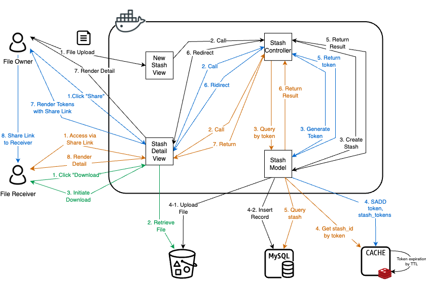

# File Stashes

A simple file sharing app allows users to upload and share files.

## Features

1. A user can upload and share files.
2. Sharing links are randomly generated.
3. Sharing links will expire (in 1 hour).

## Prerequisites

The following tools are developed based on the following versions. Other versions may work but not tested.

* Ruby version: 3.2.2
* Rails version: 7.1.2

### Notice

1. Starting from Rails 7, `vips` becomes the default variant processor. If you are using MacOS, you may need to install `vips` manually. See [this issue](https://guides.rubyonrails.org/upgrading_ruby_on_rails.html#active-storage-default-variant-processor-changed-to-vips) and [refence](https://stackoverflow.com/questions/70849182/could-not-open-library-vips-42-could-not-open-library-libvips-42-dylib)

    ```bash
    brew install vips
    ```

2. To show preview of PDF and video files, you need to install `poppler` and `ffmpeg` manually. See [reference](https://api.rubyonrails.org/classes/ActiveStorage/Preview.html)

    ```bash
    brew install poppler ffmpeg
    ```

## Getting Started

1. Check out the repository

    ```bash
    git clone git@github.com:absoluteyl/file-stashes.git
    ```

2. Install dependencies

    ```bash
    bundle install
    ```

3. Generate master key and credentials

    ```bash
    # Generate master key
    EDITOR=echo rails credentials:edit
    ```

4. We use [dotenv](<https://github.com/motdotla/dotenv>) to manage environment variables. Copy `.env` from example and fill in required values for your own environment.

    ```bash
    cp .env.example .env
    ```

5. Create and setup the database

    ```bash
    rails db:setup
    ```

6. Start the Rails server

    ```bash
    rails s
    ```

## Run the app using Docker

1. Build docker image

    ```bash
    docker build -t file-stashes:latest .
    ```

2. Generate self-signed ssl certificate using [mkcert](https://github.com/FiloSottile/mkcert)

    ```bash
    # (Optional) If you don't have mkcert installed, install it first:
    brew install mkcert
    # (Optional) Install root certificate after installation
    mkcert -install

    # Generate certificate for domain "docker.localhost" and their sub-domains
    mkcert -cert-file certs/local-cert.pem -key-file certs/local-key.pem "docker.localhost" "*.docker.localhost"
    ```

3. Copy `docker-compose.yml` from example

    ```bash
    cp docker-compose.yml.example docker-compose.yml
    ```

4. Run docker containers

    ```bash
    # (Optional) add -d to run in background
    docker-compose up
    ```

## Design

### Architecture

As shown in the following diagram, the app is composed of 4 components:

1. **App**: A rails app that provides web interface for users to upload and share files.
2. **Storage**: AWS S3 bucket that stores files uploaded by users.
3. **Database**: A MySQL database that stores metadata of files.
4. **Cache**: A Redis instance that stores sharing links and their expiration time.



#### File Storage

Above diagram also shows the flow of uploading and sharing a file. Rails' native storage library - ActiveStorage provides an interface to flexible switch between storage services like AWS S3, Google Storage or Azure Blob. In this case, we use AWS S3 as the storage service for it's remarkable SLA. While uploading a file, ActiveStorage will also store metadata of the file to the MySQL.

#### Sharing the file

After the file is been uploaded, user can generate a temporary share link to the file. The share link is composed by a random generated token of 16 hex characters. This token is stored in Redis with expiration time of *1 hour*. When another user visits the share link, the app will check if the token exists in Redis. If it exists, the app will redirect the user to the file detail page where user can preview or download the file. Otherwise, the app will return 404 error.

### Scalability for the future

Since the app is been dockerized, it's easy to scale in/out the app horizontally by workload. We can use a load balancer to distribute the traffic to multiple app instances. The app instances can share the same database and cache instance.
To reduce the data transfer cost of storage, we can also use a CDN to cache the files to avoid constantly fetching files from S3.
